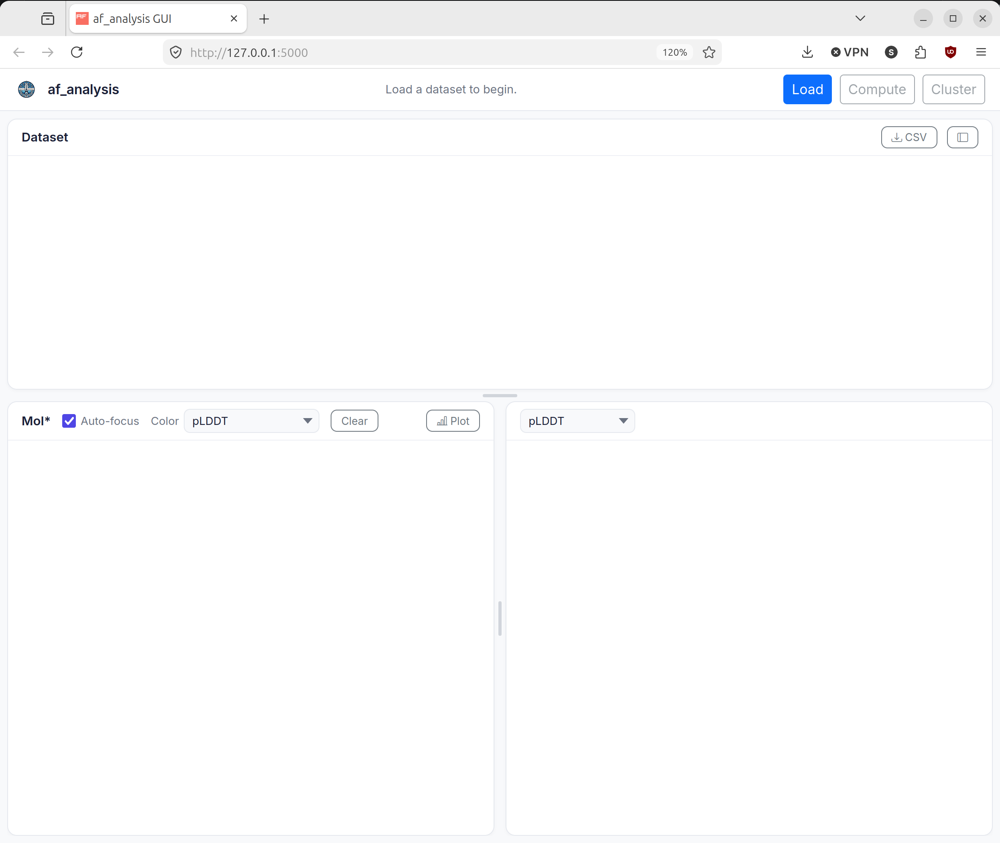

Graphical User Interface (GUI)
==================

``af_analysis_gui`` provides a local web interface for browsing AlphaFold result sets loaded through ``af_analysis``. The GUI combines a dataset table, a Mol* structure viewer, score plots, and clustering views so the same loaded dataset can be inspected without writing a notebook.

Overview
--------

The GUI is implemented as a Flask application and is distributed as an optional extra:

.. code-block:: bash

   pip install "af-analysis[gui]"

Launch it with the console entry point:

.. code-block:: bash

   af_analysis_gui

or directly as a module:

.. code-block:: bash

   python -m af_analysis_gui.flask_app

By default the server starts on ``http://127.0.0.1:5000``. If the port is already in use, the application automatically tries the next available port.

Main Interface
--------------

The main page is split into three working areas:

* A top toolbar for loading a dataset and opening the compute and clustering dialogs.
* A dataset table that exposes identifier and score columns for every loaded model.
* Two synchronized bottom panels: a Mol* viewer for structures and a plot panel for pLDDT, PAE, matrix scores, MDS scatter plots, and dendrograms.

  Overview of the main ``af_analysis_gui`` workspace.

Typical Workflow
----------------

1. Open the load dialog and choose either a results directory or a previously exported CSV file.

   .. figure:: _static/af_analysis_gui/gui_overview_load.png
      :alt: Load dialog in af_analysis_gui with fields for a results directory or CSV file and an input format selector.
      :width: 100%
      :align: center

      The load dialog used to open a results directory or CSV file.

2. You can browse the filesystem from the load dialog, or paste a path directly into the input field.
   The GUI accepts both directories and CSV files and tries to auto-detect the format.
   If auto-detection fails, select the appropriate format manually from the dropdown menu.

   .. figure:: _static/af_analysis_gui/gui_overview_browse.png
      :alt: File browser dialog in af_analysis_gui showing directories and CSV files available for selection.
      :width: 100%
      :align: center

      The built-in browser for selecting a results directory or CSV file.

3. After loading the dataset, inspect the table and click a row to update both the structure viewer and the plot panel.

   .. figure:: _static/af_analysis_gui/gui_overview_loaded.png
      :alt: Loaded af_analysis_gui dataset showing the results table, structure viewer, and plot panel after selecting a model.
      :width: 100%
      :align: center

      A loaded dataset with a selected model displayed in the viewer and plot panel.

4. Compute additional metrics when the current dataset does not yet contain ``pdockq2``, ``LIS``, ``LIA``, ``ipTM_d0``, or ``ipSAE`` values.

   .. figure:: _static/af_analysis_gui/gui_overview_score.png
      :alt: Compute scores dialog in af_analysis_gui with options for pdockq2, LIS and LIA, and ipTM_d0 and ipSAE calculations.
      :width: 100%
      :align: center

      The score computation dialog for adding derived metrics to the loaded dataset.

5. Run clustering to generate MDS coordinates, cluster labels, dendrogram data, and superposed multi-model views.

   .. figure:: _static/af_analysis_gui/gui_overview_cluster.png
      :alt: Clustering dialog in af_analysis_gui with controls for RMSD threshold, alignment selection, and distance selection.
      :width: 100%
      :align: center

      The clustering dialog used to configure and run hierarchical clustering.

Supported Inputs
----------------

The load dialog accepts either:

* A directory containing AlphaFold results readable by ``af_analysis.Data``.
* A CSV file previously exported from the library or from the GUI.

The format selector exposes the formats supported by the current GUI implementation:

* ``auto``
* ``default``
* ``colabfold_1.5``
* ``AF3_local``
* ``AF3_webserver``
* ``alphapulldown``
* ``alphapulldown_full``
* ``boltz1``
* ``chai1``
* ``massivefold``
* ``full_massivefold``

GUI Features
------------

Dataset table
~~~~~~~~~~~~~

The table is populated from the loaded ``Data.df`` dataframe. The interface keeps identifier columns such as ``query``, ``model``, and ``seed`` visible when they exist, and it can export the current table as CSV.

Structure viewer
~~~~~~~~~~~~~~~~

The Mol* panel loads the structure corresponding to the selected row and supports multiple coloring schemes, including pLDDT, chain ID, cluster label, secondary structure, sequence ID, and element type.

Plots
~~~~~

The plot panel can display:

* Per-residue pLDDT curves.
* PAE matrices.
* LIS and cLIS matrices when those scores are present.
* ``ipTM_d0`` and ``ipSAE`` matrices when they have been computed.
* MDS scatter plots and dendrograms after clustering.

Computed metrics
~~~~~~~~~~~~~~~~

The compute dialog exposes three analysis actions from ``af_analysis.analysis``:

* ``pdockq2``
* ``LIS_LIA`` with configurable PAE and distance cutoffs
* ``iptm_d0`` together with ``ipSAE`` with a configurable PAE cutoff

Clustering
~~~~~~~~~~

The clustering dialog runs hierarchical clustering on the loaded dataset with configurable threshold, alignment selection, distance selection, and optional RMSD normalization. The GUI stores the resulting universes so selected clustered frames can also be returned as an already superposed multi-model PDB.

Command-Line Usage
------------------

The ``af_analysis_gui`` command accepts an optional dataset path and three flags:

.. list-table:: Command-line arguments
   :header-rows: 1

   * - Argument
     - Description
   * - ``directory``
     - Optional path to a result directory or CSV file to load immediately at startup.
   * - ``--host``
     - Host interface to bind. The default is ``127.0.0.1``.
   * - ``--port``
     - Preferred port. The default is ``5000``.
   * - ``--format``
     - Force a specific input format instead of using auto-detection.

HTTP API
--------

The browser interface is backed by a small JSON API implemented in ``af_analysis_gui.flask_app``.

.. list-table:: Main endpoints
   :header-rows: 1

   * - Endpoint
     - Method
     - Purpose
   * - ``/api/load``
     - ``POST``
     - Load a dataset from a directory or CSV file.
   * - ``/api/browse``
     - ``GET``
     - Browse directories and CSV files from the local filesystem.
   * - ``/api/table`` and ``/api/row/<idx>``
     - ``GET``
     - Retrieve visible table data and the full content of a selected row.
   * - ``/api/plddt`` and ``/api/pae``
     - ``GET``
     - Return residue-level confidence values and PAE matrices.
   * - ``/api/lis``, ``/api/lia``, ``/api/iptm_d0``, ``/api/ipsae``
     - ``GET``
     - Return computed pairwise score matrices when present.
   * - ``/api/structure``
     - ``GET``
     - Return the selected PDB or mmCIF structure text for Mol*.
   * - ``/api/compute``
     - ``POST``
     - Run score calculations on the loaded dataset.
   * - ``/api/cluster``
     - ``POST``
     - Run hierarchical clustering and expose MDS and dendrogram results.
   * - ``/api/superpose``
     - ``GET``
     - Return a superposed multi-model PDB for selected clustered rows.
   * - ``/api/progress/stream``
     - ``GET``
     - Stream progress updates as server-sent events.
   * - ``/api/export_csv`` and ``/api/health``
     - ``GET``
     - Export the current dataset or report application state.

API Reference
-------------

af\_analysis\_gui package
~~~~~~~~~~~~~~~~~~~~~~~~~~

.. automodule:: af_analysis_gui
   :show-inheritance:

CLI entry point
~~~~~~~~~~~~~~~

.. autofunction:: af_analysis_gui.__main__.main_cli

Flask application entry point
~~~~~~~~~~~~~~~~~~~~~~~~~~~~~

.. autofunction:: af_analysis_gui.flask_app.main